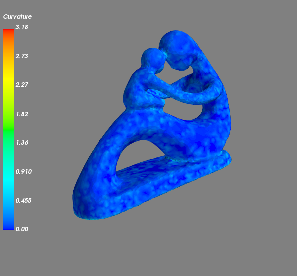

# DiffGeoOps

This repository contains a Python implementation of the paper:

>[Discrete Differential-Geometry Operators for Triangulated 2-Manifolds. *Mark Meyer*, *Mathieu Desbrun*, *Peter Schröder* and *Alan H. Barr*. *VisMath 2002*](http://www.multires.caltech.edu/pubs/diffGeoOps.pdf)

This module implements the discrete versions of three differential geometry operators that have been discussed in the paper. They are:

- Mean Curvature
- Gaussian Curvature
- Principal Curvature

## Usage

```
$ python3 DiffGeoOps.py -h
usage: DiffGeoOps.py [-h] --mode MODE [--ops OPS] [--mesh MESH] [--save]
                     [--title TITLE]
                     i [i ...]

First, use '--mode 0' to generate files for containing value of the
operator and then plot the operatore using '--mode 1' and '--mesh'. For
--ops, the operations are encoded as:
  - 1: Mean Curvature
  - 2: Gaussian Curvature
  - 3: Principal Curvatures
Note that each operation is performed for all the input files.

positional arguments:
  i              path to input file(s)

optional arguments:
  -h, --help     show this help message and exit
  --mode MODE    specifies mode for program:
                 - 0: For computation
                 - 1: For Plotting
  --ops OPS      number to denote all the operations to be
                 performed on each file.
  --mesh MESH    mesh on which curvatures were calculated (redundant in computation mode)
  --save         flag for saving the plot (redundant in computation mode)
  --title TITLE  title of plot (redundant in computation mode)
```


First you need to provide a 3D mesh as an input to the code with `--mode 0` for computation. The mesh should be in Object File Format (.off). Then use the command with `--mode 1` for plotting. For more explaination, see Example Usage.

### Example Usage

```
$ # Calculating Gaussian Curvature of a Torus mesh
$ python3 DiffGeoOps.py --mode 0 --op 2 torus.off
$ # Plotting the generated values. The file generated will be <MESH-NAME>_<OP>.npy
$ python3 DiffGeoOps.py --mode 1 --mesh torus.off torus_KG.npy
```

You can also provide multiple files as input for `--mode 0` now:

```
$ # Calculating Mean and Gaussian curvatures for 2 meshes
$ python DiffGeoOps.py --mode 0 --op 12 example_meshes/torus.off example_meshes/moebius.off
[DiffGeoOps]: Mean Curvature for example_meshes/torus.off saved to ./example_meshes/torus_KH.npy
[DiffGeoOps]: Gaussian Curvature for example_meshes/torus.off saved to ./example_meshes/torus_KG.npy
[DiffGeoOps]: Mean Curvature for example_meshes/moebius.off saved to ./example_meshes/moebius_KH.npy
[DiffGeoOps]: Gaussian Curvature for example_meshes/moebius.off saved to ./example_meshes/moebius_KG.npy
```

**Note**: The plot mode does not yet support multiple inputs


## Some results
- Plot of Gaussian curvature for Torus


<br> <br>
- Plot of Mean curvature for the Mother-son mesh



## License 

Copyright (c) 2019 Aditya Chetan

For license information, see [LICENSE](LICENSE) or http://mit-license.org


- - -

This code was written as a part of my independent study in **Differential Geometry** with [Dr. Kaushik Kalyanaraman](https://www.iiitd.ac.in/kaushik) at IIIT Delhi during Winter 2019 Semester. 

For bugs in the code, please write to: aditya16217 [at] iiitd [dot] ac [dot] in


